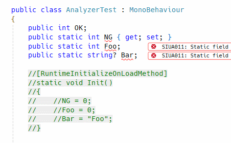

[](https://www.nuget.org/packages/SatorImaging.UnityAnalyzers)
&nbsp;
[](./README.ja.md)
[](./README.zh-CN.md)
[](./README.md)


Roslyn analyzers to ensure safe and correct code when developing with Unity.

- [Async Method Analysis](#async-method-analysis)
  - [SIUA001](#siua001-unreliable-unity-object-access): Unreliable Unity object access
  - [SIUA002](#siua002-await-in-safe-block): Await in safe block
- [Async Invocation Analysis](#async-invocation-analysis)
  - [SIUA021](#siua021-async-invocation-detected): Async invocation detected
- [Static State Analysis](#static-state-analysis)
  - [SIUA011](#siua011-static-state-survives-across-play-modes): Static state survives across play modes
  - [SIUA012](#siua012-missing-state-reset-in-runtimeinitializeonloadmethod): Missing state reset in RuntimeInitializeOnLoadMethod
  - [SIUA013](#siua013-static-property-with-body-may-return-invalid-static-state): Static property with body may return invalid static state
  - [SIUA014](#siua014-static-event-with-body): Static event with body


# Async Method Analysis

`UnityAsyncMethodAnalyzer` ensures safe usage of `UnityEngine.Object` (MonoBehaviour, ScriptableObject, etc.) within `async` methods.

It checks all `async` methods declared in any type, including standard C# classes, structs, and records (not just `MonoBehaviour` or Unity-specific types).

## `SIUA001`: Unreliable Unity object access

**Severity: Error**

Accessing instance members (methods, properties, fields, events) of a Unity object inside an `async` method is potentially unsafe because the underlying native object might be destroyed while the managed wrapper still exists.

**Rule:**
You must guard the access with a robust null check using `if (obj != null)`.

**Why it matches:**
- Any instance member access on a `UnityEngine.Object` derivative.
- Usage of `?.` operator (e.g., `obj?.Prop`) is considered **unsafe** because it bypasses Unity's custom equality check that handles lifetime validity.

**Safe Pattern:**
```csharp
if (unityObject != null)
{
    unityObject.DoSomething(); // OK
}
```

**Unsafe Pattern:**
```csharp
await Task.Yield();

unityObject.DoSomething(); // Error: SIUA001
unityObject?.DoSomething(); // Error: SIUA001 (?. is bypassed)
```

**First Await Exception:**

Unity object access **before and within** the first `await` expression is safe and will not trigger SIUA001.

```csharp
// Safe: access before any await
unityObject.DoSomething();

// Safe: access within the first await expression
await unityObject.SomeAsyncMethod();

// Error: access after the first await completes
unityObject.DoSomethingElse(); // Error: SIUA001
```

This is because Unity objects cannot be destroyed before the async method yields control for the first time.

## `SIUA002`: Await in safe block

**Severity: Warning**

Using `await` inside a "Safe Block" (an `if (obj != null)` block) invalidates the safety guarantee. When the async method resumes after the `await`, the Unity object may have been destroyed in the meantime.

**Rule:**
Shall not use `await` inside a block guarded by a Unity object null check.

**Unsafe Pattern:**
```csharp
if (unityObject != null)
{
    await Task.Delay(100);

    // unityObject might be destroyed here!
    unityObject.DoSomething(); 
}
// Warning: SIUA002 reported on 'await'
```

**Correct Pattern:**
Check for null *after* the `await` if you need to access the object.

```csharp
await Task.Delay(100);

if (unityObject != null)
{
    unityObject.DoSomething();
}
```

---

## Common Analysis Behavior

The following rules and limitations apply to ALL diagnostics in `UnityAsyncMethodAnalyzer`.

### Safe Block Definition (Strictness)

The analyzer is strict about what constitutes a "Safe Block".
- **ALL** conditions in the `if` statement must be Unity object null checks.
- If you combine a Unity check with ANY other condition (e.g., `unityObj != null && someBool`), the block is treated as **UNSAFE**.
- It typically only accepts `if` statements (not ternary `? :`).
- The condition must be a direct inequality check against `null` (e.g., `x != null`) or composed of them using `&&` (Logic AND).
- **Complex conditions** (e.g., `||`, pattern matching `is not null`, or helper methods) may be **misdetected** (treated as unsafe blocks).

### Limitation: No Data Flow Analysis

The analyzer does **not** verify that the checked variable matches the accessed/usage variable. It simply treats any block guarded by a **valid Unity Object null check** as "Safe".

**Implication for SIUA001:**
It skips analysis for the block if *any* Unity Object check is detected, even if you access a different object.

```csharp
// Valid (Analysis skipped)
// The analyzer considers the block "safe" because Unity object 'foo' is checked, 
// even though Unity object 'bar' is being accessed without a check.
if (foo != null) 
{
    bar.DoSomething(); // No Error (False negative)
}
```

**Implication for SIUA002:**
It strictly enforces "No Await" inside the block, even if the check is unrelated to the awaited task.

```csharp
// Warning (Strict enforcement)
if (foo != null) 
{
    await Task.Delay(10); // Warning: SIUA002
}
```

### Limitation: Early Returns

The analyzer does not perform control flow analysis, so "Early Return" style checks are **not** recognized as creating a Safe Block.

**Workaround:**
Invert the condition and use an `else` block (or put the code inside the `if`).

```csharp
// Unsafe (Analysis does NOT support this)
if (unityObject == null) return;

unityObject.DoSomething(); // Error: SIUA001
```

```csharp
// Safe (Using else block)
if (unityObject != null)
{
    unityObject.DoSomething(); // OK
}
else
{
    return;
}
```

This workaround applies to **SIUA002** as well:

```csharp
// Unsafe (SIUA002 triggers because await is INSIDE the if)
if (unityObject != null)
{
    unityObject.DoSomething();
    await DoFurtherAsync(); // Warning: SIUA002
}
```

```csharp
// Safe (await is OUTSIDE the checked block)
if (unityObject != null)
{
    unityObject.DoSomething();
}
else
{
    return;
}

await DoFurtherAsync(); // OK
```

# Async Invocation Analysis

`AsyncInvocationAnalyzer` detects untracked async execution sources that can escape explicit control flow.

## `SIUA021`: Async invocation detected

**Severity: Error**

This rule reports an error for:
- Calling a method that returns `Task`, `Task<T>`, `ValueTask`, or `ValueTask<T>` except when directly `await`-ed (e.g. `AsyncMethod();`).
- Creating or assigning anonymous functions that are async or return a task-like type (e.g. `Action a = async () => await Task.Delay(1);`, `Func<Task> f = () => Task.CompletedTask;`).
- Delegate or event-handler assignment from task-returning method groups (e.g. `eventHandler += TaskReturningMethod;`, `handler = TaskReturningMethod;`).
- Method group references to task-returning methods or watched API types (e.g. `var m = TaskReturningMethod;`).
- Field/property/event references on watched API types (e.g. `var p = synchronizationContext.Post;`, `var e = timer.Elapsed;`).
- Object creation of watched API types (e.g. `new System.Threading.Timer(_ => { });`).
- Method invocations on watched API types (e.g. `Task.Run(() => { });`, `ThreadPool.QueueUserWorkItem(_ => { });`, `Parallel.For(0, 10, _ => { });`).
- Watched threading/task APIs:
  - `System.Threading.Tasks.Task`
  - `System.Threading.Thread`
  - `System.Threading.ThreadPool`
  - `System.Threading.Tasks.Parallel`
  - `System.Threading.SynchronizationContext`
  - `System.Threading.Timer`
  - `System.Threading.PeriodicTimer`
  - `System.Timers.Timer`
  - `System.Threading.Tasks.TaskCompletionSource`
  - `System.Threading.Tasks.TaskCompletionSource<T>`

## Promise Type Customization

You can customize the promise exception type name through `.editorconfig`:

```ini
[*.cs]
unity_analyzers_promise_type_name = MyCustomPromise  # Default: Promise
```

Use the exact key `unity_analyzers_promise_type_name` (plural `analyzers`).

The value is loaded once during analyzer startup and then cached for the analyzer lifetime (changes require restart/reload to apply).

## Limitation: `async void`

`async void` has no awaitable handle (`Task`/`ValueTask`) and no completion/error propagation contract for callers, so call sites cannot reliably track or compose its execution.  
For that reason, `async void` flows are technically not fully trackable by invocation-tracking patterns.

# Static State Analysis

`UnityStaticStateAnalyzer` ensures that static state doesn't survive across play modes when Domain Reloading is disabled.



## `SIUA011`: Static state survives across play modes

**Severity: Error**

Static fields and properties survive across play modes in Unity if Domain Reloading is disabled. This can lead to unexpected behavior where state from a previous session persists into the next one.

**Rule:**
Static fields and properties should be reset when the project is loaded or entering play mode. This is typically done using a method marked with the `[RuntimeInitializeOnLoadMethod]` attribute.

**Why it matches:**
- Any static field (except `const` or `readonly` fields of immutable types like `string`, primitive types, or `readonly struct`).
- Any static property (except getter-only properties of immutable types).
- The class does NOT contain a static method marked with `[RuntimeInitializeOnLoadMethod]` or `[RuntimeInitializeOnLoadMethodAttribute]`.

**Safe Pattern:**
```csharp
public class MyService
{
    public static int Counter;

    [RuntimeInitializeOnLoadMethod(RuntimeInitializeLoadType.SubsystemRegistration)]
    static void Init()
    {
        Counter = 0;
    }
}
```

**Unsafe Pattern:**
```csharp
public class MyService
{
    public static int Counter; // Error: SIUA011
}
```

## `SIUA012`: Missing state reset in RuntimeInitializeOnLoadMethod

**Severity: Error**

Static fields, properties, and events that require a reset (see SIUA011) must be explicitly assigned a value within any method marked with the `[RuntimeInitializeOnLoadMethod]` attribute.

**Rule:**
All mutable static state in the class must be reset via simple assignment (`=`) in the initialization method.

**Unsafe Pattern:**
```csharp
public class MyService
{
    public static int Counter;
    public static string Status;

    [RuntimeInitializeOnLoadMethod]
    static void Init()
    {
        Counter = 0;
        // Status is NOT reset! -> Error: SIUA012 reported on 'Init'
    }
}
```

## `SIUA013`: Static property with body may return invalid static state

**Severity: Warning**

Static properties with a getter body (not auto-implemented) may return invalid or stale static state when Domain Reloading is disabled.

**Rule:**
Consider using an auto-implemented property instead. (e.g. `static int Property { get; } = 0;`)

**Why it matches:**
- Any static read-only property that is not auto-implemented (has a body or expression body).

**Unsafe Pattern:**
```csharp
public class MyService
{
    // Warning: SIUA013
    public static int Counter => 123;
}
```

**Safe Pattern:**
```csharp
public class MyService
{
    public static int Counter { get; } = 123;
}
```

## `SIUA014`: Static event with body

**Severity: Warning**

Static events with a custom `add` or `remove` body are not allowed. Only auto-implemented static events can be reliably tracked and reset by the analyzer.

**Rule:**
Static events must be auto-implemented. (e.g. `public static event Action OnSomething;`)

**Unsafe Pattern:**
```csharp
public class MyService
{
    // Error: SIUA014
    public static event Action OnSomething { add { ... } remove { ... } }
}
```

**Safe Pattern:**
```csharp
public class MyService
{
    public static event Action OnSomething;
}
```

> [!TIP]
> If you try to reference the analyzer in `Directory.Build.props` or a similar shared file, use the following condition to enable it only if the C# project is a Unity project:
> `Condition=" $([System.String]::Copy('$(DefineConstants)').IndexOf('UNITY_5_6_OR_NEWER')) != -1 "`
>
> **Full sample `.props`:**
> ```xml
> <Project>
>
>     <!-- UnityAnalyzers -->
>     <ItemGroup Condition=" $([System.String]::Copy('$(DefineConstants)').IndexOf('UNITY_5_6_OR_NEWER')) != -1 ">
>         <PackageReference Include="SatorImaging.UnityAnalyzers" Version="*-*">
>             <PrivateAssets>all</PrivateAssets>
>             <IncludeAssets>runtime; build; native; contentfiles; analyzers</IncludeAssets>
>         </PackageReference>
>     </ItemGroup>
>
> </Project>
> ```
